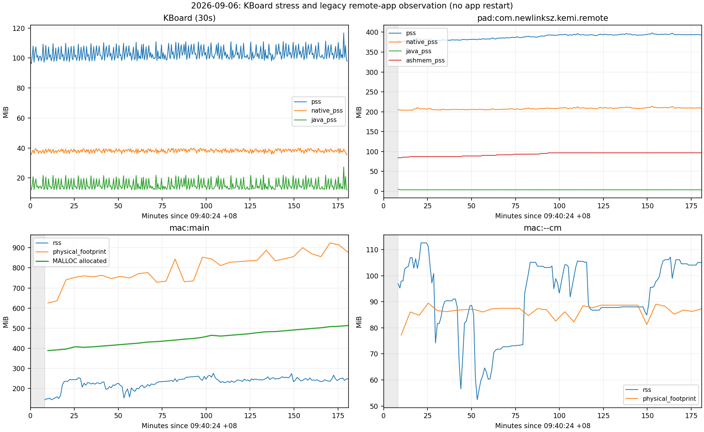
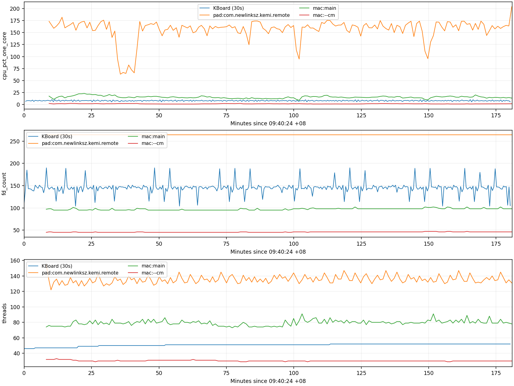

# Android75 KBoard 三小时稳定性压力测试与双端资源观察

日期：2026-09-06；全部时间为 Asia/Shanghai（UTC+08）。

## 结论

KBoard 生命周期压力测试通过：**2026-09-06T09:40:24+08:00 至 2026-09-06T12:40:40+08:00，10816.211 秒（3 小时 16 秒）**，3290 次动作全部成功，506 个完整阶段通过。主进程 PID 26438 全程未变，重启 0，FATAL、ANR、token 异常、输入分发超时、可见状态不符和迟到回弹均为 0。运行结束 HOME 截图与双重可见断言确认键盘隐藏。

KBoard 内存周期回落，未观察到持续的堆或 FD 增长。PAD 远程办公前段 Ashmem 阶梯增长，后段接近平台，不能把前段全部增长认定为泄漏。**macOS 旧版主进程实际 MALLOC 分配持续增长，资源门禁不通过；本报告不宣布双端无泄漏，也不证明尚未安装的 autoreleasepool 修复有效。**

## 版本、设备与覆盖边界

- 设备 192.168.3.75:5555，Android 12 / API31，D0；KBoard 包 com.newlink.kemi.kboard，1.4.1/152，arm64-v8a。
- 固定 APK：/private/tmp/kboard-token-regression/final-811f6dec.apk；SHA-256：`811f6dec318dfae45d1776fb5bf717f86f2f143e61daceb1ac567f615ed9c227`。起止设备回读一致；安装目录和 PID/start_ticks（4590986）在运行中校验。
- 生命周期修复提交：0734d979361c910c0788384a0dcaba538f3bd826。canonical main 后续已有 b8007d07 中继权限提交；本轮没有重装包，因此不能把后续源码状态当成新 APK 验证。
- macOS 应用 /Applications/KEMI远程办公.app，v1.4.120(227)，主进程 18666，--cm 18686，未包含主任务新增 autoreleasepool 修复。PAD 远程办公 com.newlinksz.kemi.remote PID32656，原已运行包未替换；本轮未建立其独立 APK 哈希版本基线。
- KBoard 从 09:40:24 连续采样，352 点，约30秒一次。旁路从09:48:34才开始；09:45有人工作业基线，最初约8分钟没有双端连续曲线。采样器自身09:50重启一次以补足首个vmmap，应用与主测试未重启；合并两个旁路文件并按ISO时间对齐，不能拼接进程局部 monotonic 时钟。
- 旁路终点12:41:14，约172分钟覆盖，每分钟资源采样、每5分钟及结束时vmmap。图中灰色区域表示早期覆盖缺口。旁路停止略晚于IME测试，末次CPU包含结束后的HOME状态。
- 仅观察原有远程会话进程，未自动循环真实远程连接/断开，也未覆盖Windows、D2、ASR、中文候选和其他Android版本；不能替代这些专项验收。

## 方法与成功率

运行 `fcitx5-android/scripts/stress-ime-lifecycle.py --seconds 10800 --interval 3 --sample-seconds 30 --output <独立证据目录>`；每次约3秒动作间隔，Notes真实软键q、w与两次退格逐步校验输入字段，显示/隐藏、HOME/恢复、设置/编辑器焦点切换，以及中继/主IME重建交替执行。重建断言token变化。显示同时检查系统 mInputShown 与窗口 mWindowVisible/mDecorViewVisible，结束后静置检查迟到显示。

预检曾使用ADB文字注入并触发现有物理键盘模式，随后改为真实软键；预检不是本轮应用故障，不计入正式次数。本轮没有异常吞噬补丁、计时显示重试、重装、pm clear或应用重启。

|动作|成功/尝试|成功率|
|---|---:|---:|
|soft-key-q|506/506|100%|
|soft-key-w|506/506|100%|
|soft-backspace-1|506/506|100%|
|soft-backspace-2|506/506|100%|
|hide|127/127|100%|
|show|506/506|100%|
|home|127/127|100%|
|resume-editor|127/127|100%|
|focus-settings|126/126|100%|
|focus-editor|126/126|100%|
|relay|126/126|100%|
|final-home|1/1|100%|

阶段闭环次数：show-hide=127, home-resume=127, focus-switch=126, relay-recreate=126。轮号127包含末轮部分阶段，不能把127称为127套完整四阶段。可见状态断言 888 次，均匹配。

## 资源数据

内存单位MiB（原始KB除1024）；CPU按单核100%计，200%约等于占用两个核。PSS、RSS和macOS physical footprint含义不同，不能互换或直接累加。表中“净增/小时”为首末差除实际覆盖时长，“回归/小时”为全段最小二乘斜率；缓存预热、GC和场景变化均可影响斜率，正斜率本身不能证明泄漏。最终状态为HOME隐藏，与初始显示场景不同。

### KBoard (30s)

|指标|初值|最小|峰值|终值|净增/小时|回归/小时|末小时回归|
|---|---:|---:|---:|---:|---:|---:|---:|
|pss (MiB)|97.570|96.146|116.655|97.921|0.117|0.493|1.108|
|rss (MiB)|234.203|232.926|255.383|236.508|0.767|0.996|1.498|
|native_pss (MiB)|36.605|35.519|39.937|35.519|-0.362|0.087|-0.111|
|native_alloc (MiB)|38.747|37.312|44.715|37.312|-0.478|-0.247|-0.406|
|java_pss (MiB)|12.426|12.039|27.305|12.133|-0.098|-0.052|0.885|
|cpu_pct_one_core|6.977|5.570|10.388|5.747|-0.411|-0.019|-0.145|
|fd_count|112.000|104.000|190.000|105.000|-2.330|-0.035|-5.411|
|threads|46.000|46.000|52.000|52.000|1.997|1.571|0.000|
### pad:com.newlink.kemi.kboard

|指标|初值|最小|峰值|终值|净增/小时|回归/小时|末小时回归|
|---|---:|---:|---:|---:|---:|---:|---:|
|pss (MiB)|100.326|96.831|110.787|98.128|-0.764|1.408|-1.264|
|rss (MiB)|237.547|234.148|249.117|236.715|-0.289|1.879|-0.866|
|native_pss (MiB)|37.562|35.519|40.647|35.519|-0.710|0.331|-0.522|
|native_alloc (MiB)|40.241|37.310|43.656|37.310|-1.019|0.218|-0.945|
|java_pss (MiB)|14.129|11.973|21.637|12.379|-0.608|0.651|-1.060|
|ashmem_pss (MiB)|0.128|0.128|0.128|0.128|0.000|0.000|0.000|
|ashmem_rss (MiB)|0.641|0.641|0.641|0.641|0.000|0.000|0.000|
|cpu_pct_one_core|8.691|3.798|9.084|3.798|-1.711|-0.065|-0.517|
|fd_count|148.000|104.000|190.000|105.000|-14.945|-1.072|-7.058|
|threads|47.000|47.000|52.000|52.000|1.738|1.355|0.000|
### pad:com.newlinksz.kemi.remote

|指标|初值|最小|峰值|终值|净增/小时|回归/小时|末小时回归|
|---|---:|---:|---:|---:|---:|---:|---:|
|pss (MiB)|379.399|375.285|397.966|393.039|4.740|6.660|0.212|
|rss (MiB)|600.203|596.145|631.371|626.355|9.089|11.227|0.326|
|native_pss (MiB)|205.676|203.460|213.878|209.062|1.177|2.121|0.153|
|native_alloc (MiB)|217.576|215.755|225.511|221.522|1.372|2.115|0.351|
|java_pss (MiB)|5.441|3.617|5.441|3.617|-0.634|-0.013|-0.022|
|ashmem_pss (MiB)|84.378|84.378|96.784|96.784|4.312|4.502|0.095|
|ashmem_rss (MiB)|169.254|169.254|194.066|194.066|8.624|9.004|0.190|
|cpu_pct_one_core|173.294|63.260|203.778|203.778|10.659|4.820|6.496|
|fd_count|264.000|264.000|264.000|264.000|0.000|0.000|0.000|
|threads|155.000|122.000|155.000|131.000|-8.341|1.308|-2.130|
### mac:main

|指标|初值|最小|峰值|终值|净增/小时|回归/小时|末小时回归|
|---|---:|---:|---:|---:|---:|---:|---:|
|rss (MiB)|143.906|143.797|275.984|248.750|36.438|20.234|-2.260|
|physical_footprint (MiB)|624.900|624.900|924.300|877.000|88.521|73.728|66.476|
|cpu_pct_one_core|17.651|8.897|23.139|13.519|-1.445|-0.771|-0.144|
|fd_count|97.000|95.000|102.000|98.000|0.348|1.443|0.455|
|threads|74.000|73.000|91.000|78.000|1.390|1.263|1.150|
### mac:--cm

|指标|初值|最小|峰值|终值|净增/小时|回归/小时|末小时回归|
|---|---:|---:|---:|---:|---:|---:|---:|
|rss (MiB)|96.906|52.391|112.609|105.094|2.846|4.196|24.952|
|physical_footprint (MiB)|77.200|77.200|89.500|87.300|3.546|0.700|-2.475|
|cpu_pct_one_core|2.496|1.125|2.537|1.803|-0.242|-0.127|-0.345|
|fd_count|45.000|45.000|47.000|46.000|0.348|0.500|0.078|
|threads|32.000|29.000|33.000|30.000|-0.695|-0.408|-0.043|

## 趋势判定与限制

- **KBoard：**30秒主采样PSS首99912KB、末100271KB，原生分配39677→38207KB、Java PSS12724→12424KB；多次GC/隐藏后回到近基线。FD112→105，瞬态峰190并回落；线程46→52，后段稳定在52，未见随126次重建线性累积。Views812和ViewRoots2保持稳定。可判本轮资源表现正常，但单设备3小时不能证明不存在所有长期泄漏。
- **PAD远程办公：**Ashmem PSS约84.4→96.8MiB，前段阶梯上升，约11:14后基本平台（后续仅小量增量）；PSS后段围绕约393–398MiB波动。Native有小幅净增但峰后回落，Java稳定，FD264恒定。表现更接近缓存/共享缓冲区高水位，仍需结合分配归属和更长稳态测试，不能仅凭平台排除泄漏。CPU中位约1.6核，末次203.8%需保留场景变化解释，不归为IME崩溃。
- **macOS主进程：**MALLOC实际allocated 388.5→513.1MiB；allocation count 2,896,680→3,899,773。这比RSS回落更直接支持旧包对象持续保留风险。physical footprint采样首624.9MiB，峰924.3MiB，末877.0MiB；vmmap记录的进程生命周期峰值971.5MiB，与离散采样峰值分别列出。footprint还含堆碎片、压缩/交换与其他映射，不能把全部增长归因同一泄漏。已向RustDesk主任务回传，不为该旧包风险重启或修改本次KBoard测试。
- **macOS --cm：**footprint预热后约80–90MiB波动，RSS受驻留/交换影响明显，FD与线程有界，未见与主进程同样的持续堆增长证据。
- 旁路有1次采样失败：11:27:33发现的PID85134在详细ps采样前消失。四个主要进程没有缺失或身份变化。发现逻辑含子孙进程，可能为短生命周期子进程；错误记录没有保存命令，不能事后确认其身份。必须作为采样限制保留，不能计为已证实的主进程崩溃，也不能声称所有短生命周期server均完整覆盖。
- 定向门控单测10/10、兼容单测3/3与Release构建已在V1.62记录；本轮只运行固定APK压力测试。既有ThemeSerializationTest.version2失败未在本轮修复。

## 证据与复现

原始目录：`/private/tmp/kboard-3h-20260906-attempt1`。包含summary、identity、逐动作operations、阶段cycles、可见状态states、352点resources、全程logcat、周期截图、final-hidden.png、exit-info和旁路vmmap。exit-info最新进程退出记录在08:45安装时，早于正式测试。全程日志关键字复核无FATAL EXCEPTION、ANR in、Window token is not set yet、Input dispatching timed out。未发布、未推送、未上传APK。

本报告附 `resources.csv`（合并时间线）、`statistics.csv`（全部指标与末小时斜率）、`mac-heap.csv`（实际堆分配与生命周期峰）、`summary.json`、`sidecar-summary.json`、`evidence-sha256.txt`。原始大日志与APK不进入Git；原始证据哈希清单用于后续核对。
